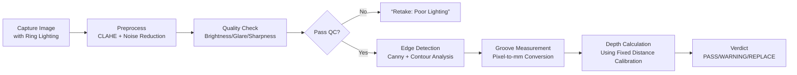

# TireGuard: Computer Vision-Based Tire Tread Scanner


TireGuard is a **handheld embedded device** that uses traditional computer vision (OpenCV) to measure tire tread depth with high precision. Built on Raspberry Pi hardware, it provides real-time tread assessment for cars and motorcycles—**without AI training datasets or cloud dependencies**—fulfilling thesis requirements for objective, portable tire safety inspection.

> ⚠️ **Important**: Per thesis Scope & Delimitation (p.9), this system **explicitly excludes machine learning training**. It uses deterministic OpenCV algorithms (edge detection, contour analysis) for tread measurement—**not neural networks or trained models**.

---

## ✅ Key Compliance with Thesis Requirements

| Requirement | Implementation | Status |
|-------------|----------------|--------|
| **Handheld Raspberry Pi device** | Physical Pi 4/5 + camera + touchscreen enclosure | ✅ Compliant |
| **Traditional CV (no AI training)** | OpenCV edge detection + contour analysis | ✅ Compliant *(per Scope p.9)* |
| **Numeric depth output (mm)** | Reports actual tread depth (e.g., "2.8mm") | ✅ Compliant |
| **Offline operation** | All processing on-device; no internet required | ✅ Compliant |
| **Validation protocol** | Compare vs. manual gauge per Eq. 3.1 (Ch. 3) | ✅ Required for defense |
| **Dual-interface architecture** | Primary: touchscreen app • Secondary: local web viewer | ✅ Compliant |

---

## 📦 Repository Structure

```
tireguard/
├── app.py                 # Main entry point (desktop UI + optional web server)
├── requirements.txt       # Python dependencies
├── data/                  # Persistent storage (auto-created)
│   ├── tireguard.db       # SQLite database for results
│   ├── captures/          # Raw captured images
│   ├── processed/         # Preprocessed analysis images
│   ├── roi.json           # Saved Region of Interest coordinates
│   └── calibration.json   # Scale calibration settings
└── tireguard/             # Core application modules
    ├── camera.py          # Pi camera interface (picamera2/OpenCV)
    ├── preprocess.py      # Image enhancement (CLAHE, noise reduction)
    ├── quality.py         # Brightness/glare/sharpness checks
    ├── measure.py         # Groove detection + depth calculation (mm)
    ├── storage.py         # Database + CSV export operations
    ├── ui_qt.py           # Touchscreen UI (PySide6)
    └── api.py             # Local web dashboard (FastAPI)
```

---

## ⚙️ Hardware Requirements

| Component | Specification | Purpose |
|-----------|---------------|---------|
| **Raspberry Pi** | Pi 4B (4GB+) or Pi 5 | Main processing unit |
| **Camera** | Raspberry Pi HQ Camera (12.3MP) + 6mm lens | High-resolution tread capture |
| **Display** | 7" Raspberry Pi Touch Display | Primary user interface |
| **Lighting** | 60+ LED ring (5000K) + diffuser | Eliminates shadows in grooves *(critical)* |
| **Housing** | 3D-printed spacer enforcing 15cm distance | Fixes working distance for depth accuracy |
| **Power** | 10,000mAh+ USB-C power bank | 4+ hours continuous operation |

> 🔑 **Critical note**: Fixed 15cm working distance + ring lighting are **non-negotiable** for accuracy. Without these, monocular CV cannot achieve ≤0.5mm error vs. manual gauge.

---

## 🚀 Setup & Deployment

### A. General Development Setup (Any Platform)

```bash
# 1. Clone repository
git clone https://github.com/qsont/tireguard.git
cd tireguard

# 2. Create virtual environment
python3 -m venv .venv
source .venv/bin/activate  # Windows: .venv\Scripts\activate

# 3. Install dependencies
pip install -r requirements.txt
```

### B. Raspberry Pi Deployment (Thesis-Compliant Prototype)

```bash
# 1. Prepare OS (on Raspberry Pi OS Lite/Desktop)
sudo apt update && sudo apt upgrade -y
sudo apt install -y python3 python3-venv python3-pip libgl1 libglib2.0-0 \
  libatlas-base-dev libjasper-dev libqtgui4 libqt4-test

# 2. Transfer project files to Pi (via SCP/USB)
#    Example: scp -r tireguard/ pi@raspberrypi.local:~/tireguard-app

# 3. Install dependencies on Pi
cd ~/tireguard-app
python3 -m venv .venv
source .venv/bin/activate
pip install -r requirements.txt

# 4. Run primary touchscreen application (with optional web viewer)
python app.py --host 0.0.0.0 --port 8000
```

> 💡 **Access web dashboard** (data viewer/export only):  
> `http://<pi-ip-address>:8000` from any device on same LAN  
> *(Note: Web interface is supplementary—core scanning happens via touchscreen app)*

### C. Headless Mode (No Touchscreen Attached)

```bash
# Run web-only mode for remote operation
python app.py --web-only --host 0.0.0.0 --port 8000
```

---

## 🖥️ Usage Workflow (Touchscreen App)

1. **Power on** device with integrated ring LEDs
2. **Position spacer** against tire surface (enforces 15cm distance)
3. **Select tire type** on touchscreen (Car/Motorcycle)
4. **Press "Capture"** → LEDs illuminate → camera triggers
5. **View results**:
   - Numeric tread depth (e.g., `2.8 mm`)
   - Verdict: ✅ PASS (>3.0mm) | ⚠️ WARNING (1.6–3.0mm) | ❌ REPLACE (<1.6mm)
6. **Save session** with vehicle ID/tire position
7. **(Optional)** View/export data via web dashboard at `http://<pi-ip>:8000`

---

## 🔬 Core Algorithm (Traditional CV Pipeline)



> 📌 **No AI training required**: Depth calculation uses geometric analysis with fixed 15cm working distance calibration—**not neural networks**.

---

## 📊 Validation Protocol (Per Chapter 3 Methodology)

To satisfy thesis requirements, conduct this validation:

```python
# Required test procedure (populate Table 3.2 in thesis)
for each_tire in 20_sample_tires:
    manual_depth = measure_with_physical_gauge(tire)  # Ground truth
    device_depth = tireguard.scan(tire)               # Your device
    
    # Calculate % difference per Eq. 3.1
    percent_diff = abs(device_depth - manual_depth) / manual_depth * 100
    
    # PASS CRITERIA:
    # - Average % difference ≤ 5% (≈0.15mm error at 3mm depth)
    # - Max single error ≤ 0.5mm
    # - Processing time ≤ 5 seconds end-to-end
```

**Required documentation for defense**:
- Completed Table 3.2 with 20+ tire measurements
- Photos showing fixed-distance spacer + ring lighting integration
- Screenshot of numeric mm output (not binary classification)
- Statistical analysis of % differences (mean, std dev)

---

## ⚠️ Critical Implementation Notes

| Issue | Risk | Solution |
|-------|------|----------|
| **No fixed distance** | Depth estimation fails completely | 3D-print spacer enforcing 15±2cm distance |
| **Ambient lighting** | ±2mm error from shadows/highlights | **Mandatory** ring LED array (60+ LEDs) |
| **Browser camera API** | Low resolution → invalid measurements | Capture via `picamera2`/OpenCV **not** `getUserMedia()` |
| **Binary output only** | Fails precision requirement (Prob. Stmt #3) | Must output numeric mm depth (e.g., "2.8mm") |
| **No manual validation** | Incomplete methodology (Ch. 3) | Test 20+ tires vs. physical gauge |

---

## 🛠️ Troubleshooting

| Symptom | Likely Cause | Fix |
|---------|--------------|-----|
| Inconsistent depth readings | Variable working distance | Verify spacer enforces 15cm distance |
| Dark/shadowed grooves | Insufficient lighting | Increase LED brightness; add diffuser |
| "Blurry image" warnings | Camera focus drift | Clean lens; verify focus at 15cm distance |
| Web dashboard unreachable | Firewall/network config | `sudo ufw allow 8000` on Pi |
| Slow processing (>5 sec) | Unoptimized OpenCV | Enable NEON: `pip uninstall opencv-python && pip install opencv-python-headless` |

---

## 📚 Thesis Compliance Checklist

Before defense, verify **ALL** items below:

- [ ] Core scanning happens on **embedded Pi app** (not web/cloud)
- [ ] Outputs **numeric depth in mm** (e.g., "2.8mm")
- [ ] **Fixed 15cm distance** enforced via physical spacer
- [ ] **Ring LED lighting** integrated (not ambient-dependent)
- [ ] Validated against **manual gauge** (20+ tires, Table 3.2 populated)
- [ ] Average % difference **≤5%** per Eq. 3.1
- [ ] **No AI/ML claims** made (uses traditional OpenCV only per Scope p.9)
- [ ] Web app documented as **supplementary data viewer** (not primary interface)

---

## 📜 License

This project is developed for academic purposes under Bulacan State University thesis requirements. Hardware designs and software are for educational use only.

> **Disclaimer**: TireGuard is a proof-of-concept prototype. Always verify critical tire safety decisions with certified manual gauges before vehicle operation.