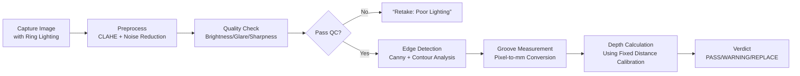

# TireGuard: Computer Vision-Based Tire Tread Scanner


TireGuard is a **handheld embedded device** that uses traditional computer vision (OpenCV) to measure tire tread depth with high precision. Built on Raspberry Pi hardware, it provides real-time tread assessment for cars and motorcycles—**without AI training datasets or cloud dependencies**—fulfilling thesis requirements for objective, portable tire safety inspection.

> ⚠️ **Important**: Per thesis Scope & Delimitation (p.9), this system **explicitly excludes machine learning training**. It uses deterministic OpenCV algorithms (edge detection, contour analysis) for tread measurement—**not neural networks or trained models**.

---

## ✅ Key Compliance with Thesis Requirements

| Requirement | Implementation | Status |
|-------------|----------------|--------|
| **Handheld Raspberry Pi device** | Physical Pi 4/5 + camera + touchscreen enclosure | ✅ Compliant |
| **Traditional CV (no AI training)** | OpenCV edge detection + contour analysis | ✅ Compliant *(per Scope p.9)* |
| **Numeric depth output (mm)** | Reports actual tread depth (e.g., "2.8mm") | ✅ Compliant |
| **Offline operation** | All processing on-device; no internet required | ✅ Compliant |
| **Validation protocol** | Compare vs. manual gauge per Eq. 3.1 (Ch. 3) | ✅ Required for defense |
| **Dual-interface architecture** | Primary: touchscreen app • Secondary: local web viewer | ✅ Compliant |

---

## 📦 Repository Structure

```
tireguard/
├── app.py                 # Main entry point (desktop UI + optional web server)
├── requirements.txt       # Python dependencies
├── data/                  # Persistent storage (auto-created)
│   ├── tireguard.db       # SQLite database for results
│   ├── captures/          # Raw captured images
│   ├── processed/         # Preprocessed analysis images
│   ├── roi.json           # Saved Region of Interest coordinates
│   └── calibration.json   # Scale calibration settings
└── tireguard/             # Core application modules
    ├── camera.py          # Pi camera interface (picamera2/OpenCV)
    ├── preprocess.py      # Image enhancement (CLAHE, noise reduction)
    ├── quality.py         # Brightness/glare/sharpness checks
    ├── measure.py         # Groove detection + depth calculation (mm)
    ├── storage.py         # Database + CSV export operations
    ├── ui_qt.py           # Touchscreen UI (PySide6)
    └── api.py             # Local web dashboard (FastAPI)
```

---

## ⚙️ Hardware Requirements

| Component | Specification | Purpose |
|-----------|---------------|---------|
| **Raspberry Pi** | Pi 4B (4GB+)| Main processing unit |
| **Camera** | Microscope like Camera with integrated Flash and capture buttons |
| **Display** | 5" Touch Display | Primary user interface |
<!-- | **Lighting** | 60+ LED ring (5000K) + diffuser | Eliminates shadows in grooves *(critical)* | -->
| **Housing** | 3D-printed spacer enforcing 15cm distance | Fixes working distance for depth accuracy |
| **Power** | Battery Pack (two li-ion battery)| 4+ hours continuous operation (theoretical but not tested) |

> 🔑 **Critical note**: Fixed 15cm working distance + ring lighting are **non-negotiable** for accuracy. Without these, monocular CV cannot achieve ≤0.5mm error vs. manual gauge.

---

## 🚀 Setup & Deployment

### A. General Development Setup (Any Platform)

```bash
# 1. Clone repository
git clone https://github.com/qsont/tireguard.git
cd tireguard

# 2. Create virtual environment
python3 -m venv .venv
source .venv/bin/activate  # Windows: .venv\Scripts\activate

# 3. Install dependencies
pip install -r requirements.txt
```

### B. Raspberry Pi Deployment (Thesis-Compliant Prototype)

```bash
# 1. Prepare OS (on Raspberry Pi OS Lite/Desktop)
sudo apt update && sudo apt upgrade -y
sudo apt install -y python3 python3-venv python3-pip libgl1 libglib2.0-0 \
  libatlas-base-dev libjasper-dev libqtgui4 libqt4-test

# 2. Transfer project files to Pi (via SCP/USB)
#    Example: scp -r tireguard/ pi@raspberrypi.local:~/tireguard-app

# 3. Install dependencies on Pi
cd ~/tireguard-app
python3 -m venv .venv
source .venv/bin/activate
pip install -r requirements.txt

# 4. Run primary touchscreen application (with optional web viewer)
python app.py --host 0.0.0.0 --port 8000
```

### D. Quick Raspberry Pi Scripts

Two helper scripts are included under `scripts/` to speed up Pi deployment:

```bash
# 1) Make scripts executable (first time only)
chmod +x scripts/rpi_setup.sh scripts/rpi_run.sh

# 2) Install system + Python dependencies
./scripts/rpi_setup.sh

# 3) Run TireGuard in compact touchscreen mode (800x480 friendly)
./scripts/rpi_run.sh
```

Manual launch presets:

```bash
# New simplified UI for 800x480 touchscreens (separate from wizard UI)
python app.py --simple-ui --no-browser --host 0.0.0.0 --port 8000

# Dedicated Raspberry Pi UI profile (compact + fullscreen)
python app.py --rpi-ui --no-browser --host 0.0.0.0 --port 8000

# Compact mode only (windowed)
python app.py --compact-ui
```

Optional environment overrides:

```bash
TIREGUARD_HOST=0.0.0.0 TIREGUARD_PORT=8000 ./scripts/rpi_run.sh
```

Add kiosk-style autostart on Raspberry Pi Desktop login:

```bash
# Install autostart entry (~/.config/autostart/tireguard.desktop)
./scripts/rpi_kiosk_autostart.sh install

# Remove autostart entry later (optional)
./scripts/rpi_kiosk_autostart.sh remove
```

Create a clickable desktop launcher icon (single-click run):

```bash
# Create ~/Desktop/TireGuard.desktop
./scripts/rpi_desktop_launcher.sh install

# Remove launcher later (optional)
./scripts/rpi_desktop_launcher.sh remove
```

### E. Update Raspberry Pi App Over SSH (from Arch Linux PC)

After pushing updates to GitHub, update the Pi remotely:

```bash
# Example host/user: pi@192.168.1.50
ssh pi@<pi-ip-address> '
    cd ~/tireguard-app &&
    git pull origin development &&
    ./scripts/rpi_setup.sh
'
```

If autostart is enabled, reboot to load the updated app at startup:

```bash
ssh pi@<pi-ip-address> 'sudo reboot'
```

> 💡 **Access web dashboard** (data viewer/export only):  
> `http://<pi-ip-address>:8000` from any device on same LAN  
> *(Note: Web interface is supplementary—core scanning happens via touchscreen app)*

### C. Headless Mode (No Touchscreen Attached)

```bash
# Run web-only mode for remote operation
python app.py --web-only --host 0.0.0.0 --port 8000
```

### F. Full Command Reference (Setup + Run + Maintenance)

Use this section as a one-stop command guide for users/operators.

#### 1) One-time setup

```bash
# Clone
git clone https://github.com/qsont/tireguard.git
cd tireguard

# Create/activate venv
python3 -m venv .venv
source .venv/bin/activate

# Install dependencies
python -m pip install --upgrade pip setuptools wheel
python -m pip install -r requirements.txt
```

Raspberry Pi quick setup (automated):

```bash
chmod +x scripts/rpi_setup.sh scripts/rpi_run.sh
./scripts/rpi_setup.sh
```

#### 2) Main run commands

```bash
# Standard app: desktop UI + web server
python app.py

# Simplified touchscreen UI (separate 800x480-friendly UI)
python app.py --simple-ui --no-browser --host 0.0.0.0 --port 8000

# Compact wizard UI
python app.py --compact-ui

# Raspberry Pi preset (compact + fullscreen)
python app.py --rpi-ui --no-browser --host 0.0.0.0 --port 8000

# Desktop UI only (no background web process)
python app.py --desktop-only

# Web API only
python app.py --web-only --host 0.0.0.0 --port 8000
```

#### 3) Raspberry Pi helper scripts

```bash
# Run with script defaults (rpi-ui + no-browser)
./scripts/rpi_run.sh

# Override host/port
TIREGUARD_HOST=0.0.0.0 TIREGUARD_PORT=9000 ./scripts/rpi_run.sh

# Pass extra app args through script
./scripts/rpi_run.sh --desktop-only
./scripts/rpi_run.sh --simple-ui
```

```bash
# Install autostart entry
./scripts/rpi_kiosk_autostart.sh install

# Remove autostart entry
./scripts/rpi_kiosk_autostart.sh remove

# Create desktop launcher
./scripts/rpi_desktop_launcher.sh install

# Remove desktop launcher
./scripts/rpi_desktop_launcher.sh remove
```

#### 4) Validation and data commands

```bash
# Run thesis validation report from manual readings
python test_accuracy.py \
    --manual-csv data/manual_readings.csv \
    --out-csv data/test_results.csv \
    --slope -6.0 \
    --intercept 6.0
```

```bash
# Open exported CSV generated by UI actions
ls -lh data/results_export.csv data/test_results.csv
```

#### 5) Build/package command (optional)

```bash
# Build standalone executable with PyInstaller
pyinstaller TireGuard.spec
```

#### 6) App CLI flags

```text
--web-only      Run web API only
--desktop-only  Run desktop UI only
--simple-ui     Run simplified 800x480 touchscreen UI
--compact-ui    Force compact UI layout
--rpi-ui        Raspberry Pi preset (compact + fullscreen)
--no-browser    Do not auto-open local dashboard
--host          Web host bind address (default: 0.0.0.0)
--port          Web port (default: 8000)
```

#### 7) Common operator recipes

```bash
# Touchscreen scanner only (no browser popup)
python app.py --simple-ui --no-browser

# Scanner + LAN dashboard
python app.py --simple-ui --host 0.0.0.0 --port 8000

# Remote dashboard only (headless)
python app.py --web-only --host 0.0.0.0 --port 8000
```

#### 8) Known placeholders

`calib/ calibrate_scale.py` and `calib/ calibrate_laser_plane.py` currently exist as empty placeholders. Add implementation before documenting runnable calibration commands there.

---

## 🖥️ Usage Workflow (Touchscreen App)

1. **Power on** device with integrated ring LEDs
2. **Position spacer** against tire surface (enforces 15cm distance)
3. **Select tire type** on touchscreen (Car/Motorcycle)
4. **Press "Capture"** → LEDs illuminate → camera triggers
5. **View results**:
   - Numeric tread depth (e.g., `2.8 mm`)
   - Verdict: ✅ PASS (>3.0mm) | ⚠️ WARNING (1.6–3.0mm) | ❌ REPLACE (<1.6mm)
6. **Save session** with vehicle ID/tire position
7. **(Optional)** View/export data via web dashboard at `http://<pi-ip>:8000`

---

## 🔬 Core Algorithm (Traditional CV Pipeline)



> 📌 **No AI training required**: Depth calculation uses geometric analysis with fixed 15cm working distance calibration—**not neural networks**.

---

## 📊 Validation Protocol (Per Chapter 3 Methodology)

To satisfy thesis requirements, conduct this validation:

```python
# Required test procedure (populate Table 3.2 in thesis)
for each_tire in 20_sample_tires:
    manual_depth = measure_with_physical_gauge(tire)  # Ground truth
    device_depth = tireguard.scan(tire)               # Your device
    
    # Calculate % difference per Eq. 3.1
    percent_diff = abs(device_depth - manual_depth) / manual_depth * 100
    
    # PASS CRITERIA:
    # - Average % difference ≤ 5% (≈0.15mm error at 3mm depth)
    # - Max single error ≤ 0.5mm
    # - Processing time ≤ 5 seconds end-to-end
```

<!-- **Required documentation for defense (subject to change if possible and )**:
- Completed Table 3.2 with 20+ tire measurements
- Photos showing fixed-distance spacer + ring lighting integration
- Screenshot of numeric mm output (not binary classification)
- Statistical analysis of % differences (mean, std dev)

--- -->

## ⚠️ Critical Implementation Notes

| Issue | Risk | Solution |
|-------|------|----------|
| **No fixed distance** | Depth estimation fails completely | 3D-print spacer enforcing 15±2cm distance |
| **Ambient lighting** | ±2mm error from shadows/highlights | **Mandatory** ring LED array (60+ LEDs) |
| **Browser camera API** | Low resolution → invalid measurements | Capture via `picamera2`/OpenCV **not** `getUserMedia()` |
| **Binary output only** | Fails precision requirement (Prob. Stmt #3) | Must output numeric mm depth (e.g., "2.8mm") |
| **No manual validation** | Incomplete methodology (Ch. 3) | Test 20+ tires vs. physical gauge |

---

## 🛠️ Troubleshooting

| Symptom | Likely Cause | Fix |
|---------|--------------|-----|
| Inconsistent depth readings | Variable working distance | Verify spacer enforces 15cm distance |
| Dark/shadowed grooves | Insufficient lighting | Increase LED brightness; add diffuser |
| "Blurry image" warnings | Camera focus drift | Clean lens; verify focus at 15cm distance |
| Web dashboard unreachable | Firewall/network config | `sudo ufw allow 8000` on Pi |
| Slow processing (>5 sec) | Unoptimized OpenCV | Enable NEON: `pip uninstall opencv-python && pip install opencv-python-headless` |

---
<!-- 
## 📚 Thesis Compliance Checklist

Before defense, verify **ALL** items below:

- [ ] Core scanning happens on **embedded Pi app** (not web/cloud)
- [ ] Outputs **numeric depth in mm** (e.g., "2.8mm")
- [ ] **Fixed 15cm distance** enforced via physical spacer
- [ ] **Ring LED lighting** integrated (not ambient-dependent)
- [ ] Validated against **manual gauge** (20+ tires, Table 3.2 populated)
- [ ] Average % difference **≤5%** per Eq. 3.1
- [ ] **No AI/ML claims** made (uses traditional OpenCV only per Scope p.9)
- [ ] Web app documented as **supplementary data viewer** (not primary interface)

--- -->

## 📜 License

This project is developed for academic purposes under Bulacan State University thesis requirements. Hardware designs and software are for educational use only.

> **Disclaimer**: TireGuard is a proof-of-concept prototype. Always verify critical tire safety decisions with certified manual gauges before vehicle operation. And also this readme file is subject to change so bear in mind some stuff will change as the full release it expected